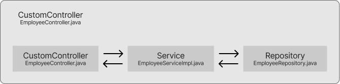

# SpringBoot_06_MVC_CRUD

Hello friends. 👋

This project contains the application to manage employees. 👷👷‍♀️ You can create, read, update and delete employees. 🔍


## Index 🚀

- [Overview 👀](#overview-)
- [Results](#results-)
- [Implementation 🪖](#implementation-)
    - [MVC](#mvc)
    - [Controller 🎛️](#controller)
    - [Model 🧑‍🤝‍🧑](#model-)
    - [Thymeleaf 🍃](#thymeleaf-)
- [Dependencies 🧰](#dependencies-)


## Overview 👀

You manage your employees by yourself. This is panal where you can:
- Create
- Read
- Update
- Delete

This project uses:

- [MVC (serving-web-content)](https://spring.io/guides/gs/serving-web-content).
- [Styles Bootstrap](https://getbootstrap.com/docs/5.3/getting-started/introduction/)
- [Manages data JPA](https://spring.io/guides/gs/accessing-data-jpa)
- Save data MySQL


## Results ✅
[video]


## Implementation 🪖

### MVC
Overview about the flow of the application


### Controller 🎛️


#### Controller
- [EmployeeController.java](src/main/java/com/luv2code/springboot/thymeleaf/controller/EmployeeController.java)
- Has the responsibility to send the view HTML.
- Manages the service to connect with the repository.
- The *Service* is injected into the *Controller*.
#### Service
- [EmployeeService.java](src/main/java/com/luv2code/springboot/thymeleaf/service/EmployeeService.java)
- Has the contract *(Interface)* about the *Repository*'s operations.
- The *Repository* is injected into the *Service*.
- Checks that the data is valid through the *Repository*.
#### Repository
- [EmployeeRepository.java](src/main/java/com/luv2code/springboot/thymeleaf/dao/EmployeeRepository.java)
- Has the responsibility to connect with the DataBase.
- Return responses using the model *Employee*

### Model 🧑‍🤝‍🧑
- [Employee]()

```java
@Entity                     // Defines that this is a entity from a daba base
@Table(name="employee")     // Defines which table representes
public class Employee {

    @Id                                                     // this property is a ID
    @GeneratedValue(strategy = GenerationType.IDENTITY)     // how this is represented
    @Column(name="id")                                      // which column from the table
    private int id;

    @Column(name="first_name")                              // which column from the table
    private String firstName;

    @Column(name="last_name")                               // which column from the table
    private String lastName;

    @Column(name="email")                                   // which column from the table
    private String email;

    public Employee() {}

    public Employee(String firstName, String lastName, String email) {
        this.firstName = firstName;
        this.lastName = lastName;
        this.email = email;
    }

    // ============================================================
    // Getters and Setters below
    // ============================================================

}
```


### Thymeleaf 🍃
- [Resources](src/main/resources)


```java

// formAdd.html

<form action="#" th:action="@{/employees/save}" th:object="${employee}" method="POST">
    <input type="hidden" th:field="*{id}">
    <input type="text" th:field="*{firstName}" class="form-control mb-4 w-25" placeholder="First Name">
    <input type="text" th:field="*{lastName}" class="form-control mb-4 w-25" placeholder="Last Name">
    <input type="email" th:field="*{email}" class="form-control mb-4 w-25" placeholder="Email">
    <button type="submit" class="btn btn-info col-2">Save</button>
</form>
```

## Dependencies 🧰
- [pom.xml 🪶](pom.xml)
    - spring-boot-starter-data-jpa
    - spring-boot-starter-web
    - spring-boot-starter-thymeleaf
    - mysql-connector-j
    - spring-boot-devtools
    - spring-boot-starter-test